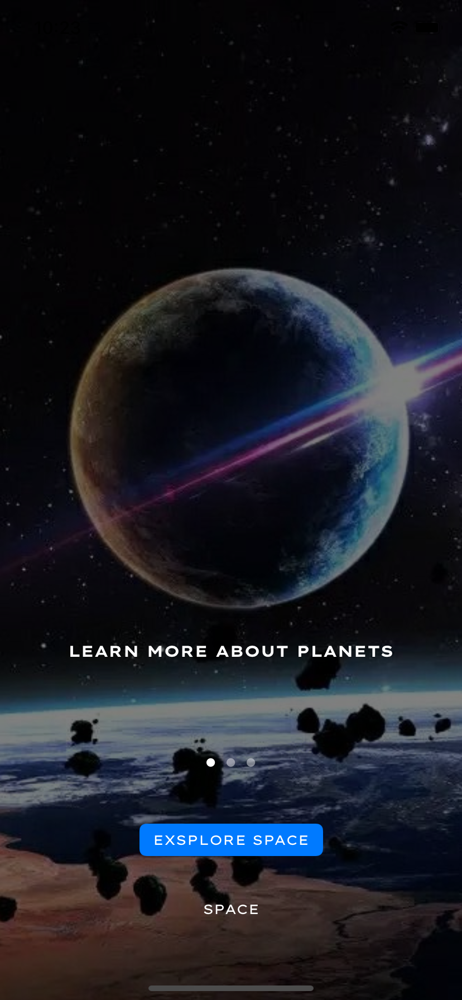
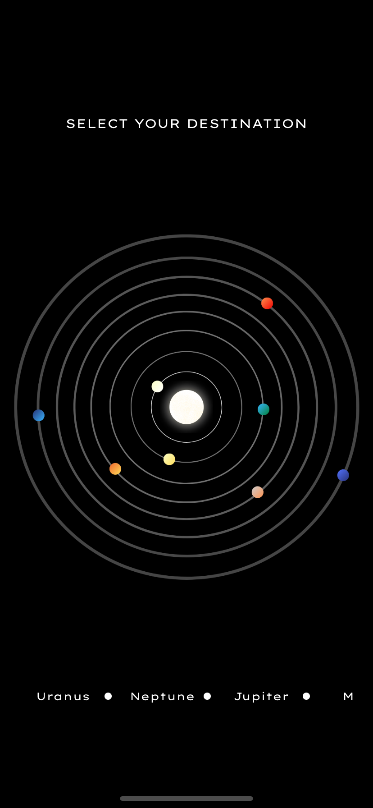
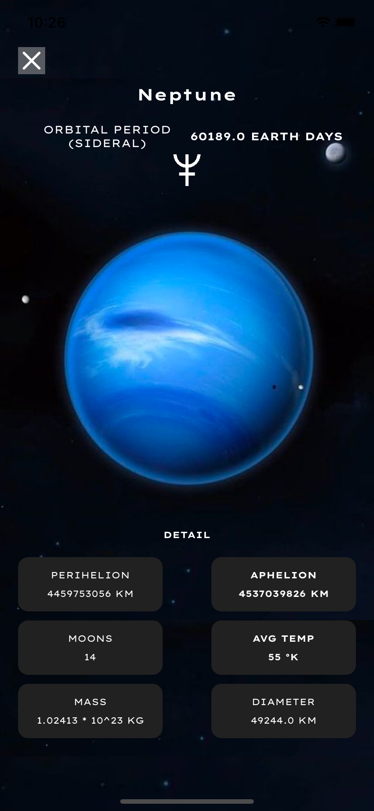

# Planets
Application showing my programming skills, consisting of 3 screens. 

## Contents

- [Information](#Information)
- [Api](#Api)
- [Photo App](#PhotoApp)

## Information
- MVC
- Xib
- Swift 5

## Api
Downloading data with: 
https://api.le-systeme-solaire.net/rest.php/bodies?filter%5B%5D=isPlanet%2Ceq%2Ctrue

I use Codable and URLSession

Data Model
```json
{
  "bodies": [
    {
      "name": "string",
      "moons": [
        {
          "moon": "string",
          "rel": "string"
        }
      ],
      "perihelion": 0,
      "aphelion": 0,
      "mass": {
        "massValue": 0,
        "massExponent": 0
      },

      "meanRadius": 0,
      "avgTemp": 0,
      "sideralOrbit": 0,
    }
  ]
}
```


## Photo App
[](./img/1.png)
[](./img/2.png)
[](./img/3.png)

